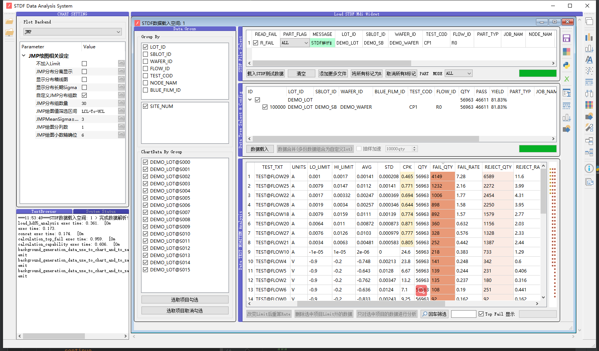

# STDF Data Analysis

## BASE

* PySide2
* UNNI TEST
  * 关键功能和UI都会经过单元测试
* Pandas
* Numpy
* SEMI-ATE
  * Parser STDF & Generator STDF
* backend
  * Altair
    * 探索式可视化
    * Future addition item
  * JMP
    * 专业的数据分析统计工具，良率预测专家
  * Pyqtgraph
    * 快速可视化，在本工具中有部分的探索式可视化功能
* Data
  * HDF5
  * CSV
* [STDF-Reader](https://github.com/guyanqiu/STDF-Reader)
  * **Only Support CPU v2 & STDFV4**

## 0. 运行条件

* Windows10 64
* Python 3.7.6 64
* JMP>13
* 拥有C盘和D盘
  * 默认会在　D:\1_STDF　路径下创建解析后的缓存路径
  * 使用HDF5 数据缓存
  * **后续会将本地的文件数据库加入**
  * 默认会将STDF解析成CSV后放入系统的TEMP文件夹内，之后由Python Pandas转为HDF5(待稳定后会直接生成)
* 注意
  * 不解析BIN，主要作为测试项目分析工具。后续可能会加入bin pareto
  * 单元测试需要HDF5解析后的数据才能运行，没有合适数据或对数据结构不了解不建议运行代码中的单元测试
  * document中的synchronization_hdf5_fields.zip压缩包内的synchronization_hdf5_fields.xlsx文件详细解释了数据如何从STDF通过DLL转为软件读取的CSV文件的格式

## 1. 界面指示

1. 文件选取
2. 绘图相关参数设定
3. 信息指示器
4. 数据载入空间
5. 绘图和数据处理相关
   1. 绘图 -> 主要是JMP和Altair
   2. 多个数据空间的数据Contact(多个数据空间的数据整合在一起) -> *暂未测试*
6. **更多功能等待完善移植，和BiliBili使用视频更新**