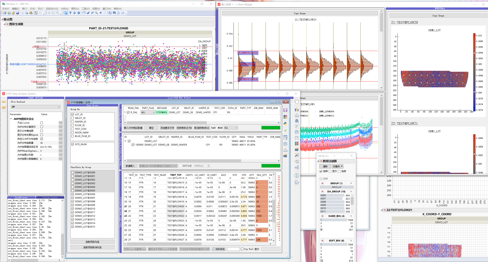

# STDF Data Analysis

## BASE

* PySide2
* Pandas
* Numpy
* SEMI-ATE
* backend
  * Altair
  * JMP
  * Pyqtgraph
* Data
  * HDF5
  * CSV
* [STDF-Reader](https://github.com/guyanqiu/STDF-Reader)
* **Only Support CPU v2 & STDFV4**

## 0. 运行条件

* Windows10 64
* Python 3.7.6 64
* JMP>13

## 1. 界面指示

